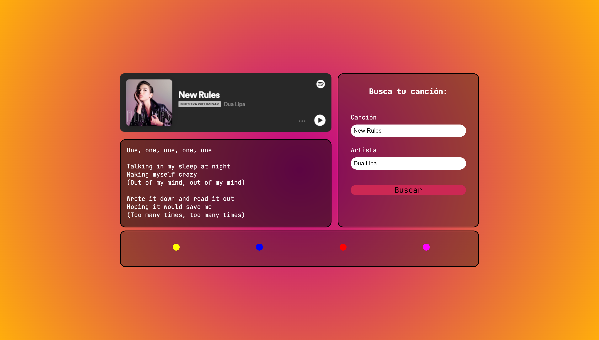

# Synesthesia

## Descripción de la aplicación

* Permite al usuario buscar una canción utilizando el nombre de la canción y/o el nombre del artista utilizando la API de Spotify.
* Muestra la previsualización de la canción utilizando la API de Spotify y permite una reproducción parcial de la canción.
* Extrae los parámetros "energy" y "valence" de la canción usando la API de Spotify. El valor de "energy" corresponde a la medida perceptiva de intensidad y actividad. Mientras que el valor de "valence" describe la positividad musical de la canción.
* Despliega la letra parcial de la canción utilizando información de la API de Musixmatch.
* Genera un fondo dinámico de colores utilizando amarillo, azul, rojo y magenta, cuya proporción de colores es definida por los parámetros de "energy" y "valence":
    * Se utiliza un arreglo de cuatro colores para formar el fondo dinámico: amarillo, azul, rojo y magenta.
    * El valor de energy define la proporción de rojo y magenta.
    * El valor de valence define la proporción de amarillo azul.
* Permite al usuario agregar dos tonos de color al presionar cierto botón de color para aumentar la presencia del color deseado.

## Tecnologías usadas

* Se utiliza localStorage para guardar el token de acceso de Spotify, así como la última búsqueda del usuario cuando se necesita refrescar el token de acceso.

* 

* 

* 

* 

## APIs usadas

* ###  (https://developer.spotify.com/documentation/web-api/)

* ### API de Musixmatch (https://developer.musixmatch.com/)

## Authors

- [Mauricio García Hernández](https://www.github.com/maugh108)
- [Julio César Del Ángel](https://github.com/JulioCesarDelAngel)
- [Diego Jonguitud Galindo](https://github.com/djonguitud)
- [Jorge Alejandro Ramírez Anzaldo](https://github.com/JorgeRamirezAnzaldo)

## Enlace a la aplicación

* [Link a aplicación](https://djonguitud.github.io/synesthesia-project/)

## Animación de la aplicación

## Captura de pantalla de la aplicación

 