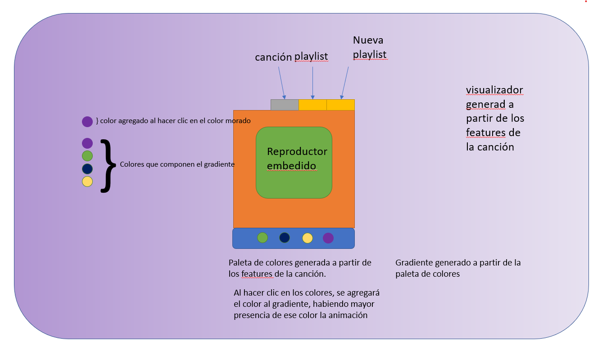

# Synesthesia

Historia de usuario:

Como usuario de spotify quiero manipular un fondo dinámico de colores combinados para así poder compartir mi experiencia con otros usuarios.

Criterios de aceptación:

Cuando abro la aplicación, entonces mostrará un cuadro de entrada de texto donde pegar la URL de la canción.

El sistema generará la paleta de colores para el gradiente animado bajo las propiedades.

El sistema generará una animación a partir de las propiedades de la canción.

El usuario tendrá los 4 colores que componen el gradiente como botones que sume ese color al gradiente, así, el color seleccionador por el usuario tendrá más presencia en el gradiente.

Al agregar una URL agregarda previamente, se cargarán los parámetros de la animación modificada por usuario

## Authors

- [Mauricio García Hernández](https://www.github.com/maugh108)
- [Julio César Del Ángel](https://github.com/JulioCesarDelAngel)
- [Diego Jonguitud Galindo](https://github.com/djonguitud)


## Demo




## API Reference


```http
https://developer.spotify.com/console/get-audio-features-several-tracks/
```


## Tareas

 - fetch API
 - animación gradiente
 - animación reactiva
 